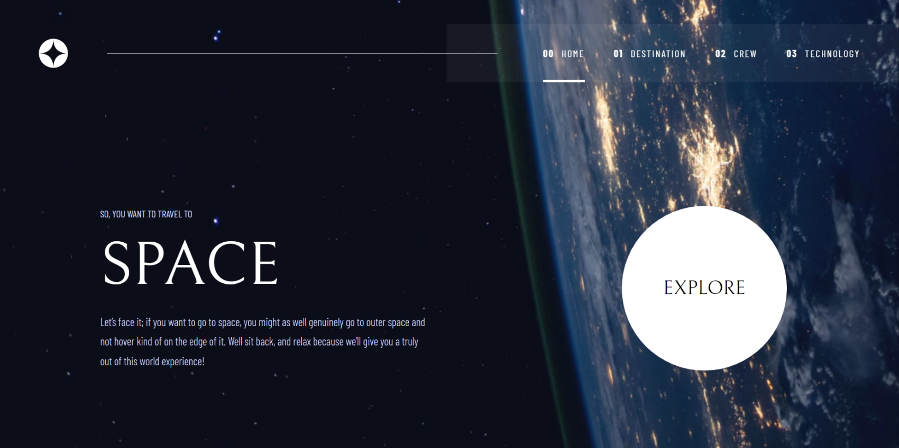

# Frontend Mentor - Space tourism website solution

This is a solution to the [Space tourism website challenge on Frontend Mentor](https://www.frontendmentor.io/challenges/space-tourism-multipage-website-gRWj1URZ3). Frontend Mentor challenges help you improve your coding skills by building realistic projects. 

## Table of contents

- [Overview](#overview)
  - [The challenge](#the-challenge)
  - [Screenshot](#screenshot)
  - [Links](#links)
- [My process](#my-process)
  - [Built with](#built-with)
  - [What I learned](#what-i-learned)
  - [Continued development](#continued-development)
- [Author](#author)

## Overview

### The challenge

Users should be able to:

- View the optimal layout for each of the website's pages depending on their device's screen size
- See hover states for all interactive elements on the page
- View each page and be able to toggle between the tabs to see new information

### Screenshot

### Links

- Solution URL: [Add solution URL here](https://www.frontendmentor.io/profile/ricardo1003/solutions)
- Live Site URL: [Add live site URL here](https://ricardo1003.github.io/Space-tourism-multi-page-website/)

## My process

### Built with

- Semantic HTML5 markup
- CSS custom properties
- Flexbox
- CSS Grid
- [React](https://reactjs.org/) - JS library
- [TailwindCSS](https://tailwindcss.com/) - CSS framework
- [React router](https://reactrouter.com/home) - multi page support
- [Framer Motion](https://motion.dev/) - for multi page animations
- [Node.js](https://nodejs.org/en)

### What I learned

I learned a lot of new things here, such as creating a multi-page website, adding transitions with react router, more about dynamic styles with TailwindCSS, and a bit more of react.

### Continued development

I would continue focusing on using tailwindCSS along with react, and discovering new libraries/frameworks such as react router and framer motion

## Author

- Website - [ricardo1003](https://github.com/ricardo1003/Space-tourism-multi-page-website)
- Frontend Mentor - [@ricardo1003](https://www.frontendmentor.io/profile/ricardo1003)
- Twitter - [@ricardo1003](https://www.twitter.com/yourusername)